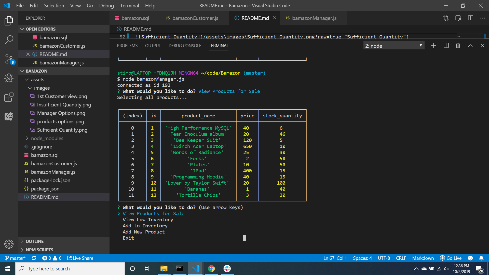
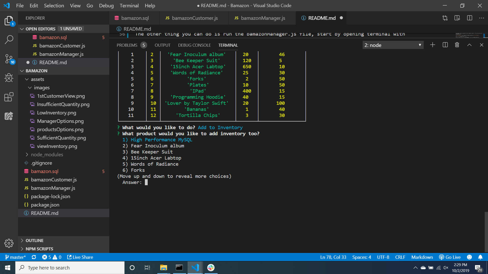
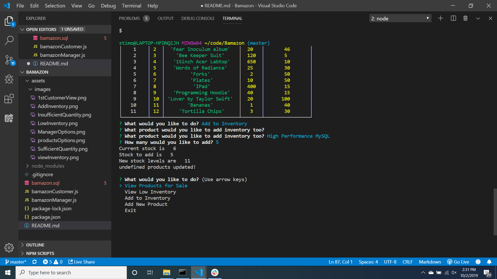
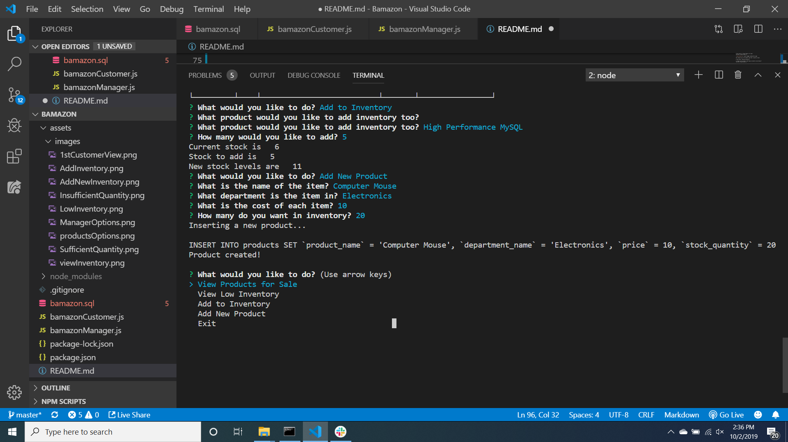

Bamazon

This application show the begining of how mysql works.  In combination with the requirer npm module. This app creates a table of products that the user can intereact with, get cost and quantities and interact through prompts to see different results.

To run the app, start with cloning the code from Github.

Then right click on the bamazonCustomer.js file, and click on open in terminal. From here we need to install the NPM files, type "npm install" this will install all the node modules we need.

The next steps are to get the .sql file running in terminal.
1st type "mysql -u root -p".  It will then prompt you to enter your password.  What you type will not show up.
2nd step is to type "source ./bamazon.sql"
3rd step is to type "exit".

You are now ready to use the application

There are 2 different javascript files.  The bamazonCustomer.js file can be run through the terminal to be used by a customer to interact with the products.
The bamazonManager.js file can be run through the terminal by the manager to interact with inventory levels.

Using bamazonCustomer.js

first open bamazonCustomer.js in the terminal.

type  "node bamazonCustomer.js"
you should see,

You will see two options from the requirer npm.
1st is to see all the products for sell.
The other is to exit.
Use the arrow keys no navigate.
If you choose the "View Products for Sale"

The next thing you will see is,

At this point the user is prompted to enter a product ID.

After they enter a product ID the next prompt asks how many of that product do they want.

The app then checks against inventory if there are enough of that product in inventory.
If there are not it shows this,

![Insufficient Quantity] (./assets/images/InsufficientQuantity.png?raw=true "Insufficient Quantity")

It then returns you to choose a new product id.

If you choose a quantity of a product that there is enough in inventory.  It tells you the total cost of the purchase.
The screen looks like,

That is it for the bamazonCustomer.js file

The other thing you can do is run the bamazonManager.js file, start by opening terminal with bamazonManager.js, then type  "node bamazonManager.js"

You will then see this screen that shows different options.

Use the arrow keys no navigate.

If you select on "View Products for Sale"
the next screen you see is,

This shows the current products and their inventory levels.

If you select "View Low Inventory"

it shows you the products that have an inventory level below 5.
the next screen you see is,

If you select "Add To Inventory"

the next screen you see is,

Use the arrow keys to select a product to add.

Next you see can choose how much of that product to add, after choosing an amount you see, 

The last option is "Add New Product"

This option is for adding a new type of product to the table, you are prompted to give the name and department and price and quantity,

At the end you see, 

The last option is exit which quits the app.

Those are the basics of the app.

Any questions can be sent to me Thomas Stimac, on my porfolio page, at https://stimoe.github.io/Thomas-Portfolio-Page/ This was solely produced by myself, Thomas Stimac

This app can also be found at my github, at https://github.com/Stimoe
